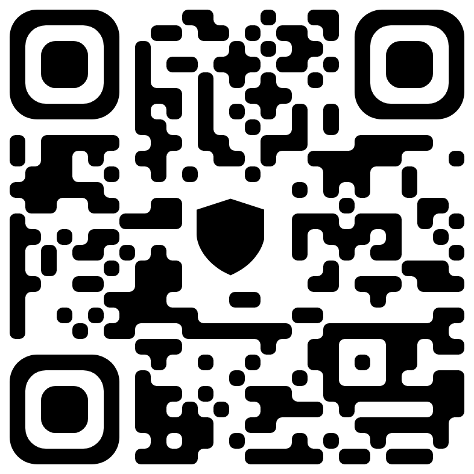
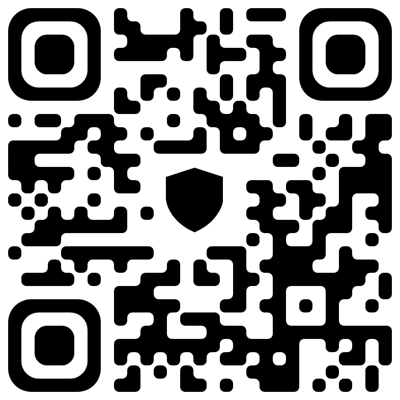
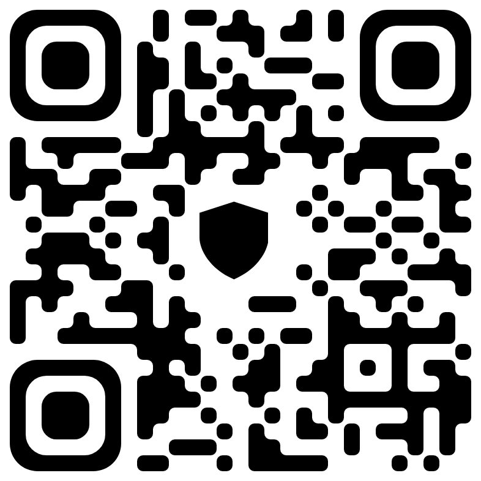

# Bitcoin

Address: `bc1qh8533kdjk8u6a2qed3r64httl3rr8dyfcp9e4a`

QR Code:

# Bitcoin Cash

Address: `qz9dtufr07ax3skqqkkg9ycldz6xr279xuj7j23uhe`

QR Code:

# Ethereum

Address: `0xb2F125bcc0af4AFe428aC65774A4ecFDA866d381`

QR Code:

# BNB (BSC-20)

Address: `0xb2F125bcc0af4AFe428aC65774A4ecFDA866d381`

QR Code:

# USDT (ERC-20)

Address: `0xb2F125bcc0af4AFe428aC65774A4ecFDA866d381`

QR Code:

# TRON

Address: `TPJsRUYB81qFrE7LwbUPu1iaB4tjh8dLVi`

QR Code:

# Dogecoin

Address: `D6uyY6wjpHCVj2rX5SkxuEhiibWm531LSb`

QR Code:

# XRP

Address: `rK9PLSChSEJv1EYWBVybM9L3EvNMbbx1nb`

QR Code:

# Digibyte

Address: `dgb1qyfuqlrw2mvkppd43wu7lzelgdu5gr3wm6vgav8`

QR Code:

# Litecoin

Address: `ltc1q3h0vwhcny7gj8yhjnf5fxr3lduu3jh0zyqwnhu`

QR Code:

